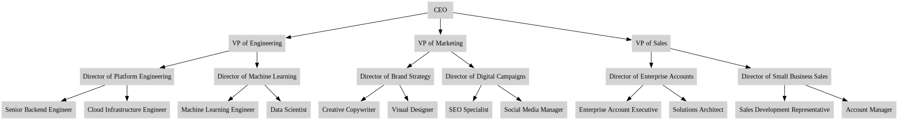

# The Agentic Heartbeat Pattern: Forget Rigid Workflows — Let AI Agents Self-Organize

**Author:** Marcilio Mendonca (PhD, Sr Solutions Architect at AWS, ML Specialist)

**Contact**: https://www.linkedin.com/in/marcilio

**Date:** August 13, 2025

Please refer to the [Medium article](https://medium.com/@marcilio.mendonca/the-agentic-heartbeat-pattern-a-new-approach-to-hierarchical-ai-agent-coordination-4e0dfd60d22d) for the most up-to-date information on the Heartbeat pattern.

## Introduction

In the rapidly evolving landscape of AI agents and Agentic workflows, we face an important and practical challenge: how do we coordinate multiple agents to solve complex problems that mirror real-world organizational structures? Traditional approaches often rely on rigid workflows or complex agent chains, but what if we could create a more natural, self-organizing system that mirrors how humans actually work together?

Recently, while working with a customer, I faced this exact challenge. My solution at the time was a complex LangChain workflow with ephemeral agents and a mix of core and composed tools. It worked — but I couldn’t shake the feeling that it could be simpler if the agents were allowed to organize themselves. That insight led me to create what I call the **Agentic Heartbeat Pattern**: a coordination approach that enables AI agents to collaborate, typically in hierarchical structures, following a natural rhythm of expansion and contraction — much like a heartbeat.

The Heartbeat Pattern can be applied to practical problems we encounter daily: building status reports across organizational hierarchies (as demonstrated in this article), analyzing supply chain networks, performing complex document review, and scientific research synthesis, or any scenario where information needs to flow both down (for data gathering) and up (for aggregation and decision-making). The Heartbeat pattern can be powerful because it requires less rigid code structure, enables self-organizing agents, and creates a natural flow where agents can serve as tools for other agents, and tools can invoke agents — creating a truly dynamic system.

## The Heartbeat Agentic Pattern

The Agentic Heartbeat Pattern gets its name from its two-phase operation that resembles a heartbeat:

1. **Expansion Phase (Diastole)**: Agents work together to explore all branches of the problem hierarchy, gathering data and information from the bottom up. Each agent reaches out to its subordinates, expanding the scope of data collection.
2. **Contraction Phase (Systole)**: Agents collaborate to aggregate and summarize results, flowing information back up the hierarchy until the root agent produces the final result.

What makes this pattern unique is its hierarchical, non-cyclic structure where agents use tools, and tools can invoke other agents, creating a natural recursive flow that mirrors real-world organizational dynamics.

### Use Case: Organizational Status Reporting

Although my customer’s use case was slightly different, to illustrate this pattern, let’s explore a practical example: building a comprehensive status report for a CEO using a gradual, hierarchical agentic approach, i.e., the Hearbeat Pattern! This example uses a fictitious organization with synthetic data generated by an LLM. The organizational structure is as follows:



In this scenario, the CEO agent needs to produce a status report for the board of directors. Rather than having pre-programmed knowledge, the CEO agent must gather information from its direct reports (VPs), who in turn must collect information from their teams, and so on, until individual contributors provide their actual status updates (Can you think of other real-world problems where information is gathered and aggregated across different levels?).

### Implementation with Strands Agents

The implementation uses the open source [Strands Agents](https://strandsagents.com/) framework, which provides excellent support for tool-calling and agent coordination. Here's how the core components work:

We begin by defining the problem’s hierarchical data structure, which mirrors the organization’s reporting lines.

#### 1. Hierarchical Data Structure

```python
hierarchical_model = {
    "CEO": ["VP of Engineering", "VP of Marketing", "VP of Sales"],
    "VP of Engineering": ["Director of Platform Engineering", "Director of Machine Learning"],
    "VP of Marketing": ["Director of Brand Strategy", "Director of Digital Campaigns"],
    "VP of Sales": ["Director of Enterprise Accounts", "Director of Small Business Sales"],
    # ... and so on down to individual contributors
}
```

Then we define the status reports of the individual contributors in the organization. Management roles will have their status reports built automatically during the contraction phase, when information is aggregated and summarized.

#### 2. The Individual Contributor's Status Reports

```python
status_updates = {
    "Senior Backend Engineer": {
        "highlights": [
            "Successfully refactored the authentication module, improving response time by 20%.",
            "Reduced API error rate by 15% through better exception handling.",
            "Completed code review for two critical feature branches ahead of schedule."
        ],
        "lowlights": [
            "Blocked on integration tests due to missing mock service.",
            "Legacy code dependencies caused delays in feature rollout."
        ]
    },
    "Cloud Infrastructure Engineer": {
        "highlights": [
            "Completed Terraform automation for staging environment.",
    # ... and so on down to individual contributors
}
```

#### 3. Core Tools

The pattern relies on three essential agentic tools that enable the heartbeat flow:

```python
@tool
def get_direct_reports(function_role: str):
    """Returns the direct reports for a given role"""
    if function_role not in hierarchical_model:
        return "You don't have any direct reports"
    return f"These are your direct reports: {','.join(hierarchical_model[function_role])}"

@tool
def produce_status_report(function_role: str):
    """Individual contributors use this to produce their status report"""
    if function_role not in status_updates:
        return f"No status report exists for role {function_role}."
    return status_report_to_markdown(status_updates[function_role])

@tool
def request_status_report_from(function_role: str):
    """Managers use this to request status reports from their direct reports"""
    # This tool creates a new agent instance for the requested role
    status_report_agent = Agent(
        agent_id=function_role,
        model=model_id,
        system_prompt="""
            Your goal is to write a status report to your manager.
            Follow this plan:
            1- Get the list of your direct reports
            2a- If you don't have direct reports, produce your own status report
            2b- If you have direct reports, request their status reports, 
                then summarize into your own report
        """,
        tools=[get_direct_reports, produce_status_report, request_status_report_from],
    )
    return status_report_agent(f"Your role in the organization is {function_role}.")
```

Note that tool `request_status_report_from` creates an ephemeral agent called `status_report_agent`. More importantly, note how the agent uses the `request_status_report_from` itself! This is due to the hierarchical nature of the problem. A manager will request her reports for their status reports. Note that there's a clear plan in place for the agent. It should end the recursion when an individual contributor role is reached, in which case the report is built from the synthetic data provided.

That's it. Three simple tools, including a tool (`request_status_report_from`) that invokes an agent (`status_report_agent`) that uses that tool, creating a recursion that eventually ends when a condition is met (the role is an IC). How cool is that?

#### 3. The Heartbeat in Action

When the CEO agent starts, it follows this natural flow:

**Expansion Phase:**

- CEO requests reports from VP of Engineering, VP of Marketing, VP of Sales
- Each VP requests reports from their Directors
- Directors request reports from their individual contributors
- Individual contributors produce their own status reports using their actual data

**Contraction Phase:**

- Individual contributors return their status reports
- Directors aggregate and summarize their teams' reports
- VPs aggregate and summarize their departments' reports
- CEO receives all VP reports and creates the final executive summary

### Model Performance Observations

An interesting discovery during implementation was the significant impact of model choice on performance. Initially using Anthropic's Claude Haiku 3.0 for performance reasons, we observed frequent hallucinations when the agents were selecting tools, leading to longer execution times and less accurate results.

Switching to Claude Sonnet 3.7 dramatically improved the results:

- More accurate tool selection
- Better understanding of hierarchical relationships
- Cleaner, more professional status report generation
- Faster overall execution despite the more powerful model

Choose your models wisely!

### Sample Output

Strands Agents offer great observability features allowing us to follow what each agent is actually doing. We simply created a callback handler that writes logs to a file. The file is named after each role in the organization. Take a look at the `logs/` folder in the GitHub repository.

Here's the code for the callback handler:

```python
def logging_handler(function_role: str, *args, **kwargs):
    message = kwargs.get("message")
    if not message:
        return

    # Only log assistant messages with content & text
    if message.get("role") == "assistant" and "content" in message:
        # Extract all "text" fields
        texts = [
            block.get("text")
            for block in message["content"]
            if isinstance(block, dict) and "text" in block
        ]

        if texts:  # Only proceed if we found any text
            markdown_text = "\n".join(texts)
            log_entry = f"## {datetime.now().strftime('%Y-%m-%d %H:%M:%S')} - {function_role}\n{markdown_text}\n\n"

            with open(os.path.join(logs_path, f"{function_role}.md"), "a", encoding="utf-8") as f:
                f.write(log_entry)
```

Here's an excerpt from the final CEO status report generated by the system:

```markdown
# CEO Status Report

## Highlights
- Financial Growth: Enterprise team secured a major $500k Fortune 500 client deal 
  while achieving 20% revenue growth in enterprise account expansions
- Product Performance: Authentication module refactoring completed with 20% 
  performance improvement and reduced API error rates by 15%
- Technical Innovation: ML team deployed improved customer churn prediction model 
  with 5% higher accuracy, providing valuable business insights
- Marketing Success: SEO performance improved with key terms now ranking on page 1, 
  driving 12% increase in organic traffic month-over-month

## Lowlights
- Development Challenges: Integration test blockers and legacy code dependencies 
  causing delays in feature rollouts
- Resource Constraints: Design and account management teams experiencing bandwidth 
  limitations affecting delivery timelines
- Sales Cycle Concerns: Extended enterprise sales cycles and legal review delays 
  affecting quarterly targets
```

And here's how an individual contributor's report looks:

```markdown
## Highlights
- Successfully refactored the authentication module, improving response time by 20%
- Reduced API error rate by 15% through better exception handling
- Completed code review for two critical feature branches ahead of schedule

## Lowlights
- Blocked on integration tests due to missing mock service
- Legacy code dependencies caused delays in feature rollout
```

The beauty of this pattern is evident in how information flows naturally from individual contributors up through the management hierarchy, with each level appropriately summarizing and contextualizing the information for their audience.

## Conclusion

The Agentic Heartbeat Pattern represents a powerful new approach to coordinating AI agents in hierarchical structures. By mimicking the natural flow of information in human organizations, it creates systems that are both intuitive and highly effective.

Key benefits of this pattern include:

- **Natural Information Flow**: Mirrors real-world organizational dynamics
- **Self-Organizing**: Agents determine their own coordination needs based on their position in the hierarchy
- **Recursive Tool Usage**: Tools can invoke agents, and agents can use tools, creating flexible interaction patterns
- **Scalable**: Works with hierarchies of any depth and complexity
- **Reusable**: The same pattern applies to supply chains, project management, decision trees, and many other hierarchical problems

While demonstrated here with status reporting, this pattern has broad applications: supply chain management, project coordination, decision support systems, organizational analysis, and any domain where information needs to be gathered from distributed sources and aggregated up through a hierarchy.

This is an experimental pattern that we hope will be useful to others building complex multi-agent systems. The combination of hierarchical structure, natural information flow, and recursive agent-tool interactions opens up new possibilities for creating more sophisticated and intuitive AI systems.

## References

- Strands Agents: https://strandsagents.com/
- Amazon Bedrock: https://aws.amazon.com/bedrock/
- Medium publication: https://medium.com/@marcilio.mendonca/the-agentic-heartbeat-pattern-a-new-approach-to-hierarchical-ai-agent-coordination-4e0dfd60d22d

Disclaimer: This article was partially AI-assisted and fully reviewed by me.
